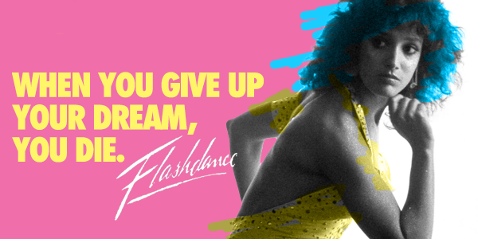
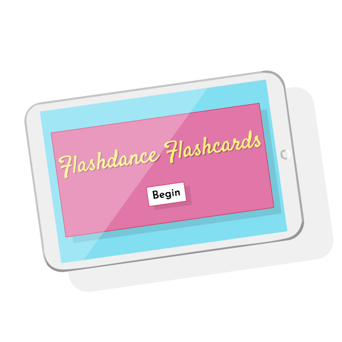

# Flashdance Flashcards - My First Project!

This is my first foray into the wonderful world of JavaScript and jQuery. The user comes to the landing page and presses the begin button to be presented with the front of the first card, revealing the first definition and a button to flip when ready. Once the user has pressed the flip button, the back of the card with the keyword and two buttons (incorrect and correct) are revealed. The user then chooses whether their knowledge of Flashdance was correct or incorrect, the score is tallied, and the next card is presented. When the user has tallied five correct cards, they have reached maniac status!

## This project was built with HTML, CSS, and jQuery's Javascript library.

This was accomplished through an array of question/answer objects hard coded in the JavaScript file. Event listeners were placed on the buttons using jQuery's .on() method to listen for user interaction and respond accordingly. jQuery's .show() and .hide() methods were used to toggle content being showed to the user. Functions were used to populate the card's content. CSS animations are meant to draw the user's eye to clickable elements in the DOM. A special YouTube video is embedded in an iFrame once the user has reached maniac status.

